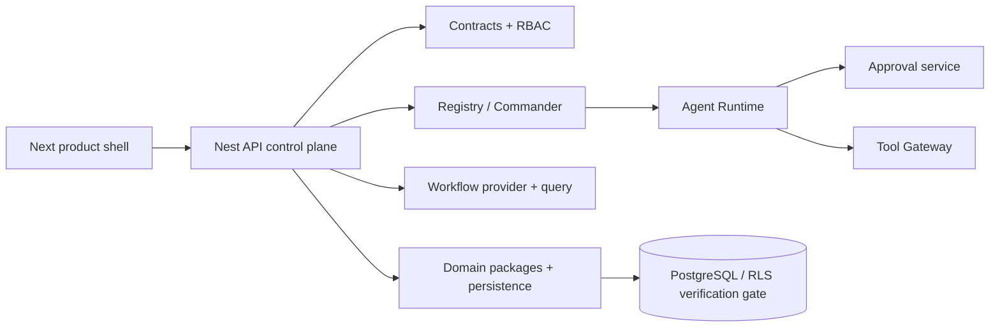
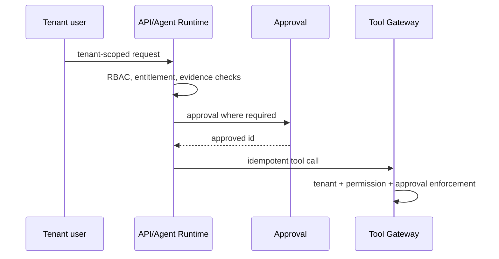
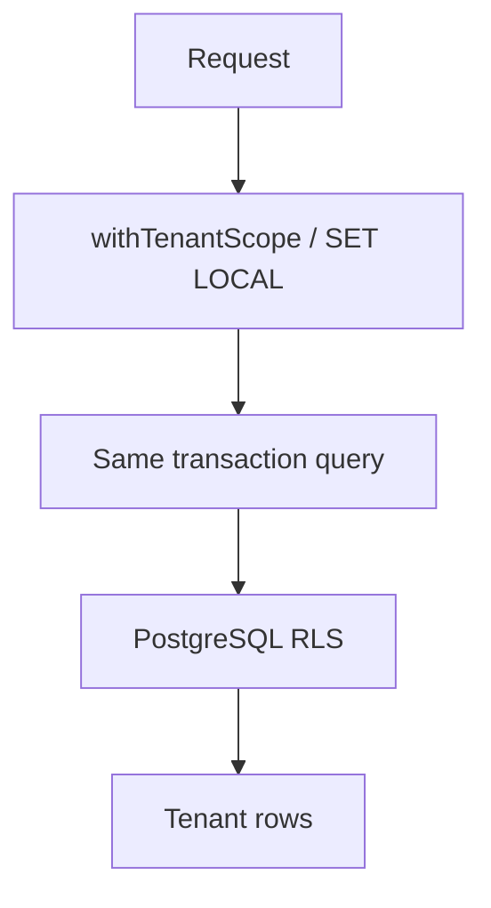

# Canonical architecture

Actual containers are `apps/web`, `apps/api`, and `apps/worker`. In-memory workflow is dev/test; Temporal mode requires injected command adapter and durable read model. Context uses memory/knowledge with citations. Billing resolves subscription, plan, override and usage before atomic consumption. The 23 UI surfaces use typed `/product-surfaces/:surface` composition responses. Temporal, PostgreSQL, and external providers are production gates, not deployed facts.
