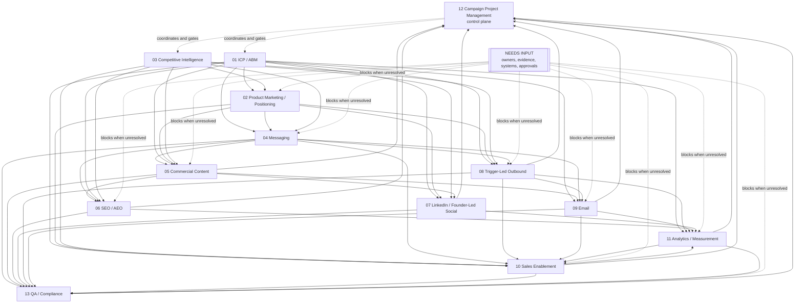

# Orchestration Dependency Graph

> **Status:** Canonical dependency specification for the 13 existing Saudi B2B AI customer acquisition workstreams.
>
> **Evidence boundary:** This specification is compiled only from the existing workstream contracts, [CATALYST strategy](../catalyst-strategy.md), [handoff protocols](../coordination/handoff-protocols.md), the Saudi GTM strategy, and referenced repository artifacts. It does not add owners, outputs, approvals, or dependencies that are not declared. Missing or ambiguous evidence is marked `[NEEDS INPUT]`.

## Workstream Registry

| ID | Name | Owner | Objective | Inputs | Outputs |
|---|---|---|---|---|---|
| 01 | ICP / ABM | ABM strategist; named seller/paired owner per active Tier 1/2 account | Select and operate a capacity-sized named-account program for the first Saudi B2B acquisition motion. | Saudi GTM; ICP hypothesis; 90-day ABM workflow; client evidence `[NEEDS INPUT]`; operating constraints `[NEEDS INPUT]`. | Capacity/coverage model; named-account ledger; parked/rejected register; tier model; signals-to-actions matrix; account orchestration contract; scoreboard and decision log. |
| 02 | Product Marketing / Positioning | Product Marketing / Positioning Strategist; named owner `[NEEDS INPUT]`; executive sponsor `[NEEDS INPUT]` | Select and document a defensible positioning frame and evidence-backed inputs for messaging, sales, channels, and offer decisions. | Saudi GTM; positioning hypotheses; ICP hypothesis; actual offer/capability/proof/legal inputs `[NEEDS INPUT]`; Workstreams 01 and 03 evidence. | Positioning decision record; approved/directional positioning statement and variants; message architecture input; claim register; alternative battle-card input; research synthesis; sales enablement input; validation backlog. |
| 03 | Competitive Intelligence | Competitive Intelligence Specialist | Determine buyer alternatives, decision criteria, comparison evidence, objections, proof requests, and defensible differentiation. | Saudi GTM; Workstreams 01 and 02 context; client capability, customer, CRM, legal, and interview inputs `[NEEDS INPUT]`; public/source evidence. | Alternative evidence ledger; alternative profiles; comparison matrix; objection/proof register; monthly change log; decision memo. |
| 04 | Messaging | Messaging Architect; named owner `[NEEDS INPUT]`; sponsor `[NEEDS INPUT]` | Turn approved or directional positioning into a usable evidence-bounded message house and persona-specific message system. | Saudi GTM; positioning hypotheses; Workstreams 01, 02, and 03; customer language, commercial, and proof sources `[NEEDS INPUT]`. | Message inventory and claim register; customer language bank/copy diff; message house; capability claim register; proof mapping; persona/message test pack; channel briefs; consistency audit; sales feedback loop; validation backlog. |
| 05 | Commercial Content | Content Strategist / Content Blog Strategist; named person `[NEEDS INPUT]`; commercial owner `[NEEDS INPUT]` | Create the smallest useful content system that moves a named account or qualified buyer toward a credible next step for one motion. | Saudi GTM; Workstreams 01, 02, 03, and 04; actual offer/proof/team/legal/measurement inputs `[NEEDS INPUT]`. | 14-day MVP asset pack; content brief/decision register; evidence/claims register; distribution/routing plan; language test log; QA/revision log; learning memo. |
| 06 | SEO / AEO | SEO / AI Search Optimizer; executive approver `[NEEDS INPUT]` | Build a search and answer-engine acquisition system from a measured research baseline, useful assets, and account progression. | Saudi GTM; Workstreams 01-05; AEO/GEO playbook; approved website/data/tool/legal/language inputs `[NEEDS INPUT]`. | Search evidence register; Saudi B2B topic map; information architecture; page briefs; AEO/GEO standard; entity/structured-data brief; terminology register; technical audit; measurement/dashboard specification; experiment backlog; refresh/citation register. |
| 07 | LinkedIn / Founder-Led Social | LinkedIn Organic Strategist / LinkedIn-Social Execution Owner; publishing founder `[NEEDS INPUT]` | Establish a founder-led LinkedIn operating loop from sourced account insight to relevant conversations and measurable account progression. | Saudi GTM; Workstreams 01, 02, and 03; approved content and paid dependencies `[NEEDS INPUT]`; founder/page/access/CRM inputs `[NEEDS INPUT]`. | Profile/page readiness record; capacity-sized social orchestration contract; two-week queue; versioned social briefs; language-test register; response ledger; weekly evidence pack; claims/proof/consent register; decision memo. |
| 08 | Trigger-Led Outbound | `sales-outbound-strategist`; paired seller; commercial owner `[NEEDS INPUT]` | Turn the approved ABM account set into a small signal-led outbound motion producing accepted seller handoffs and qualified progression. | Saudi GTM; Workstream 01; ICP and positioning hypotheses; Workstreams 02 and 03; messaging; ABM workflow; email/LinkedIn/channel/legal inputs `[NEEDS INPUT]`. | Trigger-qualified queue; account briefs/cluster cards; offer briefs; versioned sequences; language test register; consent/suppression log; seller handoff pack; objection/proof-gap register; scoreboard; sequence decision log. |
| 09 | Email | Email Lifecycle Architect / Email lifecycle owner; legal/deliverability/CRM partners `[NEEDS INPUT]` | Provide the permission-aware continuity layer across ENGAGE, QUALIFY, NURTURE, and CONVERT. | Saudi GTM; Workstream 01; content and paid dependencies `[NEEDS INPUT]`; competitive handoff `[NEEDS INPUT]`; actual offer and CRM/ESP/sending inputs `[NEEDS INPUT]`. | Sequence contracts; permission/suppression model; outbound-versus-nurture architecture; language test register; deliverability clearance; event and handoff records; dashboard views; decision log. |
| 10 | Sales Enablement | Sales Enablement Coordinator / Proposal Architect; named owner `[NEEDS INPUT]`; commercial owner `[NEEDS INPUT]` | Equip the commercial owner to qualify, propose, handle objections, and transfer a paid Pipeline Reset and Acquisition Sprint into delivery. | Saudi GTM; positioning hypotheses; Workstreams 01-04, 08, and 09; measurement system; actual package, proof, capability, legal, and client inputs `[NEEDS INPUT]`. | Discovery guide; qualification rubric; approved sprint proposal/pilot narrative; objection/alternative register; asset index; delivery handoff packet/checklist; commercial decision log; enablement feedback log. |
| 11 | Analytics / Measurement | `analytics-marketing-ops-architect`; Marketing Ops / Performance Analyst partners | Implement one auditable account-based measurement system and decision log for scale, iterate, hold, or stop decisions. | Measurement system; Saudi GTM; Workstreams 01, 08, and 09; Workstream 10 `[NEEDS INPUT]`; confirmed CRM/analytics/ESP/paid/finance/consent access `[NEEDS INPUT]`. | Instrumentation contract/event taxonomy; data dictionary; CRM implementation map; source/attribution rules; data-quality report; certified dashboard; weekly review pack; series-break register; 30/60/90 decision memos. |
| 12 | Campaign Project Management | Campaign Project Manager / Campaign Coordinator; client sponsor and decision-maker `[NEEDS INPUT]` | Orchestrate one bounded engagement through approved scope, launch, learning, and continuation decision. | Saudi GTM; ABM workflow; measurement system; Workstreams 01-11; client evidence/access/brand/legal/team inputs `[NEEDS INPUT]`. | Campaign charter/scope; integrated plan; dependency, decision, risk, and change logs; RACI; backlog; phase-gate packs; launch runbook; weekly dashboard; final decision memo/retrospective. |
| 13 | QA / Compliance | QA / Compliance owner `[NEEDS INPUT]`; qualified reviewers | Control evidence-bounded QA, language, consent/suppression, data/AI, asset function, launch readiness, and auditability. | Saudi GTM; ABM workflow; measurement system; Workstreams 04-09; Workstream 10 `[NEEDS INPUT]`; qualified legal/privacy, security, Arabic, commercial, and storage inputs `[NEEDS INPUT]`. | Claim/proof register; language review register; cross-channel suppression gate; data/AI control record; asset QA record; launch readiness packet; issue/risk log; post-launch QA report; audit trail. |

## Execution Order

The repository's CATALYST model defines the phase order as **Discovery -> Strategy -> Foundation -> Build -> Launch -> Optimize**. Within that model, the declared workstream dependencies support this execution order:

1. **Initialize Workstream 12 as the control plane.** Create the scope, dependency register, decision rights, backlog, and gate calendar. It coordinates the work; it does not replace specialist decisions.
2. **Run Workstreams 01 and 03 in parallel discovery.** 01 establishes account/segment evidence and 03 establishes alternative/decision evidence. Both feed positioning and channels.
3. **Run Workstream 02 after the initial 01/03 evidence is available.** Positioning selects or holds H1/H2/H3 and defines the proof boundary.
4. **Run Workstream 04 after positioning plus ICP/ABM and competitive evidence.** Messaging turns the approved or directional position into controlled message artifacts.
5. **Run Workstream 05 after 04.** Content produces assets from the message house and account/alternative evidence.
6. **Run Workstream 06 after the available 01-05 inputs.** SEO/AEO turns buyer jobs, alternatives, messages, and content into search/answer assets and technical requirements. Its 04/05 inputs remain `[NEEDS INPUT]` where the source contracts say so.
7. **Prepare Workstreams 07, 08, and 09 after 01-04, with 05 where their contracts require content/assets.** They may run in parallel by channel, subject to shared suppression, message, language, and measurement gates.
8. **Run Workstream 10 alongside channel preparation and before proposal/paid-engagement handoff.** It consumes the sales-relevant outputs from 01-04, 08, 09, and measurement context.
9. **Run Workstream 11 as a foundation and continuous integration stream.** It must be designed before channel launch and updated as 07-10 produce event/handoff requirements. Workstream 10's measurement dependency remains `[NEEDS INPUT]` until its contract is supplied.
10. **Run Workstream 13 before any external asset, audience activation, send, upload, or launch.** QA/Compliance consumes channel, message, content, measurement, and sales inputs and may block activation.
11. **Launch only after Workstream 12 readiness/build gates, Workstream 11 instrumentation gates, Workstream 13 approval, and the relevant channel/sales handoffs pass.**
12. **Optimize through Workstreams 11 and 12, with feedback to 01-10.** Use mature cohorts and recorded decision logs; do not turn incomplete data into conclusions.

This is a dependency order, not a claim that all workstreams must complete fully before any parallel work begins. The handoff contract permits parallel execution when the required input is available and the receiving owner accepts the handoff.

## Dependency Matrix

`Blocking` means the declared absence prevents the dependent work from starting, being approved, launching, or being measured. `Optional` means the source artifact describes the dependency as conditional, “where relevant,” “as needed,” or a supporting route. An unclassified or absent dependency is recorded as `[NEEDS INPUT]`, not inferred.

| Workstream | Upstream dependencies | Downstream consumers | Blocking dependencies | Optional dependencies |
|---|---|---|---|---|
| 01 | GTM; ICP hypothesis; ABM workflow; client evidence `[NEEDS INPUT]`; operating constraints `[NEEDS INPUT]` | 02, 03, 04, 05, 06, 07, 08, 09, 10, 11, 12, 13; paid/events/customer marketing where declared | Owner/capacity; sourced account evidence; suppression/consent; paired seller for Tier 1/2; next milestone | Paid-media feasibility; events; installed-base routing; later comparison set/holdout |
| 02 | GTM; positioning hypotheses; ICP hypothesis; 01 and 03 evidence; offer/capability/proof/legal inputs `[NEEDS INPUT]` | 04, 05, 06, 07, 08, 10, 11, 12, 13; Customer Proof | Actual capability and offer boundary; evidence sufficient to select/hold position; sponsor approval for public use `[NEEDS INPUT]` | H3 trigger-specific frame; paid-test owner; customer proof owner |
| 03 | GTM; 01/02 context; buyer/non-buyer and public/source evidence; internal capability/customer/CRM/legal/interview inputs `[NEEDS INPUT]` | 02, 04, 05, 06, 08, 10, 11, 12, 13 | Evidence traceability; six alternative tracks; source/consent discipline; approval before external comparison | Named provider dossiers; official ad-library checks where relevant; alternative economics when sourced |
| 04 | GTM; positioning hypotheses; 01, 02, 03; customer language/commercial/proof sources `[NEEDS INPUT]` | 05, 06, 07, 08, 09, 10, 12, 13; Positioning/ABM/CI feedback | Positioning status; claim/capability/proof ownership; legal/QA/public-use gate; named owner `[NEEDS INPUT]` | Qualified Arabic/bilingual reviewer where relevant; powered paid-test owner |
| 05 | GTM; 01, 02, 03, 04; actual offer/proof/team/legal/measurement inputs `[NEEDS INPUT]` | 06, 07, 09, 10, 11, 12, 13; ABM, Sales, Lifecycle, Design/Web | Named reader, evidence, capability, CTA, distribution owner, suppression, and QA gates | Search/website route; partner/event route; paid amplification/retargeting only if approved |
| 06 | GTM; 01-05; AEO/GEO playbook; website/CMS/search/analytics/legal/language inputs `[NEEDS INPUT]` | 05, 10, 11, 12, 13; Positioning, Insights, ABM, CI, Design/Web, technical SEO `[NEEDS INPUT]` | Evidence/source boundary; page job; technical access; author/reviewer; measurement path; legal/language status | Search Console/Bing/log access; answer-engine sampling; technical SEO owner; customer proof owner |
| 07 | GTM; 01, 02, 03; approved content/paid dependencies `[NEEDS INPUT]`; founder/page/CRM inputs `[NEEDS INPUT]` | 01, 02, 04/05 `[NEEDS INPUT]`, 08/10, 09, 11, 13; Insights/CI | Active ABM account set; founder approval/access; claims/language/QA; response owner; suppression; event/account-linking path | Paid extension; company page; video; partner/public conversations; Customer Marketing |
| 08 | GTM; 01; ICP and positioning hypotheses; 02, 03, Messaging; ABM workflow; channel/legal/deliverability inputs `[NEEDS INPUT]` | 09, 10, 11, 12, 13; Sales, Messaging, Positioning, CI, Deliverability | Dated trigger; reachable role; seller; suppression/channel clearance; approved offer/message; handoff SLA | Phone, LinkedIn, WhatsApp; Arabic/bilingual variant; second stakeholder; partner/referral route |
| 09 | GTM; 01; content/paid/competitive inputs `[NEEDS INPUT]`; offer and CRM/ESP/sending inputs `[NEEDS INPUT]` | 10, 11, 12, 13; Sales, Deliverability, Content, Customer Marketing | Permission/suppression; sending identity/deliverability clearance; approved audience/copy; reply owner; event reconciliation | Paid retargeting; preference center; nurture; customer transition; Arabic/English test |
| 10 | GTM; positioning hypotheses; 01-04, 08, 09; measurement system; package/proof/capability/legal/client inputs `[NEEDS INPUT]` | 11, 12, 13; Delivery, Finance, Sales/Deal Strategy | Buyer-confirmed problem; qualification; approved scope/price/terms; delivery acceptance; legal/privacy; next-step owner | Email/social assets; comparison guide; Arabic reviewer; Finance/procurement review as applicable |
| 11 | Measurement system; GTM; 01, 08, 09; 10 `[NEEDS INPUT]`; confirmed system access `[NEEDS INPUT]` | 01, 07, 08, 09, 10, 12, 13; channels, Finance, Delivery, Messaging, Content, SEO/AEO | Canonical IDs; event/stage/source definitions; consent/suppression; data-quality and reconciliation gates; system owners | Paid/partner cost feeds; AI referral capture; mature cohorts; Workstream 10 event contract |
| 12 | GTM; ABM workflow; measurement system; 01-11; client evidence/access/brand/legal/team inputs `[NEEDS INPUT]` | All 01-13; client sponsor, Finance/Procurement, Sales, Legal | Signed scope; objective/audience/conversion; owner/date/acceptance for work; critical dependencies; gate decision rights | Specific channel mix; paid spend; additional content; event/partner route; 20% contingency treatment `[NEEDS INPUT]` |
| 13 | GTM; ABM workflow; measurement system; 04-09; 10 `[NEEDS INPUT]`; qualified reviewer/access inputs `[NEEDS INPUT]` | All launch-facing workstreams; ABM, channels, Sales, Ops, Legal, Executive approver `[NEEDS INPUT]` | Claim/proof status; language review; suppression; data/AI controls; technical QA; measurement; qualified legal/privacy decision; launch approval | Paid/partner/event review; Workstream 10 scope; security reviewer; customer-proof review |

### Explicit dependency notes

- Workstream 04 exists at `strategy/workstreams/04-messaging.md`; references inside 05-09 that call its inputs `[NEEDS INPUT]` describe missing approved outputs/owners, not a missing file.
- Workstream 05 is the repository's **Commercial Content** workstream. Some channel contracts use “paid-media” or “Workstream 05” for different expected inputs; the source contracts mark those dependencies `[NEEDS INPUT]` and this specification preserves that ambiguity.
- Workstream 10 exists at `strategy/workstreams/10-sales-enablement.md`; Workstreams 11 and 13 still explicitly declare its path/owner/scope as `[NEEDS INPUT]`. The file's existence does not supply the missing declared handoff contract.
- No named provider, customer, price, market statistic, performance claim, Saudi legal conclusion, or approved proof is a dependency unless an existing artifact explicitly supplies it; the current artifacts generally mark these `[NEEDS INPUT]`.

## Handoff Contract

Every handoff follows the repository's [Handoff Protocol](../coordination/handoff-protocols.md) and the receiving workstream's downstream contract. It must include:

1. **From / to:** exact specialist/workstream owner and receiving owner.
2. **Date, phase, priority, dependency level:** `Blocks downstream work`, `Informs work`, or `Reference only`.
3. **Input artifact:** repository path, version/date, format, key sections, evidence status, and known limitations.
4. **Decision required:** what the recipient must decide or make possible.
5. **Expected output:** artifact name, scope, owner, due date `[NEEDS INPUT]` where absent, and acceptance criteria.
6. **Context and decisions:** why the work exists, prior decisions, assumptions, risks, and constraints.
7. **Dependencies:** blocking inputs, optional inputs, unresolved `[NEEDS INPUT]`, and escalation date.
8. **Approval:** required reviewer/decision owner, approval status, conditions, expiry/review date, or `[NEEDS INPUT]`.
9. **Feedback loop:** recipient returns acceptance, specific defect, or `[NEEDS INPUT]` blocker; upstream revises through the decision log.
10. **Auditability:** stable artifact/version IDs, source links, owner, next milestone, and handoff acceptance timestamp.

Silence is not acceptance. A receiving owner must accept, reject with a specific defect, or record a blocker. Workstream 12 maintains the dependency/decision register; Workstream 11 maintains measurement and reconciliation evidence; Workstream 13 maintains review and audit evidence.

## Acceptance Gates

Acceptance is workstream-specific and must be checked against the source file. The canonical cross-workstream gates are:

| Gate | Evidence required | Gate result |
|---|---|---|
| Discovery / list gate | 01 has capacity, sourced account reasons, tiers, owners, committee coverage, suppression, and next milestones; 03 has traceable alternative research and explicit unknowns. | `pass`, `conditional pass`, `hold`, or `fail`; approver `[NEEDS INPUT]` where not named. |
| Positioning gate | 02 records H1/H2/H3 status, target/alternative/anti-ICP, capability/proof boundary, buyer evidence, and sponsor decision. | Public positioning remains blocked until the stated approval path passes. |
| Messaging gate | 04 has source-mapped claims, language bank, message house, capability/proof grades, test feasibility, and accepted downstream handoffs. | Unsupported or unowned messages remain `Directional`, `Blocked`, or `[NEEDS INPUT]`. |
| Content/search gate | 05/06 have named reader/job, evidence boundary, asset/page owner, language review, CTA, technical/measurement path, and Publish/Hold/Cut or promote/revise/hold decision. | No asset or page launches on quota, traffic, ranking, or citation assumptions. |
| Channel readiness gate | 07/08/09 have cleared audience/account IDs, suppression, approved copy, language review, response owner/SLA, deliverability where email applies, and event path. | No send, social commercial interaction, upload, or channel activation without clearance. |
| Sales/paid engagement gate | 10 has buyer-confirmed problem, qualification, approved offer/scope/price/terms, delivery acceptance, proof/legal boundaries, and next milestone. | Proposal or paid sprint is `approved`, `revise`, `nurture`, `disqualify`, or `blocked`. |
| Measurement gate | 11 has stable IDs, stage/event definitions, source taxonomy, consent/suppression, dashboard, reconciliation, maturity, and data-quality checks. | Affected decisions remain provisional or blocked when a gate fails. |
| Launch/QA gate | 13 has claim/proof, language, legal/privacy, suppression, data/AI, technical, measurement, rights, rollback, monitoring, and audit records. | `launch`, `revise`, `hold`, `pause`, or `stop`. |
| Project continuation gate | 12 records scope, budget, dependencies, decision log, actuals, evidence, uncertainty, and scale/revise/hold/stop recommendation. | Client sponsor decision `[NEEDS INPUT]` where not named. |

Acceptance criteria that apply to every handoff:

- The output exists at a repository path or approved operational location `[NEEDS INPUT]`.
- The output is versioned and linked to its upstream source artifacts.
- Required evidence, source/date, status, owner, and unknowns are visible.
- The recipient can use the output without reconstructing missing context.
- Material claims, permissions, data, language, legal, and capability conditions are approved or block downstream use.
- The output includes a next action, owner, due date, escalation trigger, and feedback date.
- Acceptance or rejection is recorded; no unaccepted output is treated as complete.

## Human Approval Gates

Only approvals explicitly declared in the source artifacts are listed as approvals. Where a decision owner is not named, it remains `[NEEDS INPUT]`.

| Approval point | Declared approver / decision owner | Source evidence | Effect |
|---|---|---|---|
| Public positioning use | Designated executive sponsor `[NEEDS INPUT: name/role]`; Campaign Coordinator records the gate decision | Workstream 02 Owner section | H1/H2/H3 remains hypothesis/directional until approved. |
| Public message/claim use | Positioning, capability owner, proof/permission owner, Legal/Privacy, QA, and surface owner; sponsor records public-use approval | Workstream 04 Proof Boundary and Acceptance Criteria | Claims remain blocked/directional without required review. |
| Arabic customer-facing use | Qualified Saudi Arabic reviewer; Legal/Privacy for consent/privacy/data/contract wording | Workstreams 04-07, 09, 13 | Language variant cannot launch without qualified review. |
| Outbound/channel legality | `ops-legal-compliance` / qualified legal reviewer `[NEEDS INPUT]` | Workstreams 01, 08, 09, 13 | Affected channel waits for a decision; this graph does not infer legality. |
| Email sending readiness | Deliverability owner plus Legal/Privacy/QA and sending-system owners `[NEEDS INPUT]` | Workstream 09 deliverability and acceptance sections | No sequence launch without sending, suppression, and monitoring clearance. |
| Audience activation / suppression | Legal/compliance decision owner and channel/system owners `[NEEDS INPUT]`; ABM/sales owner accepts account readiness | Workstreams 01, 08, 13 | No send, upload, or activation while suppression/permission is unresolved. |
| Sales proposal / paid sprint | Commercial owner `[NEEDS INPUT]`; Delivery, Finance, Legal/Privacy, and relevant owners review | Workstream 10 | No proposal or paid pilot with unknown owner, price, scope, or material data issue. |
| Measurement definitions | Source-system owners, Sales Ops, Finance, Legal/Privacy, and Analytics owner; named approvers `[NEEDS INPUT]` | Workstream 11 | Stages, attribution, reconciliation, and consent rules require owning-system acceptance. |
| Campaign scope/budget | Client executive sponsor / client decision-maker `[NEEDS INPUT]` | Workstream 12 Decision Rights | No production or scope change without recorded decision. |
| Launch release | Client sponsor/executive launch approver `[NEEDS INPUT]` after QA/Legal/Measurement gates | Workstreams 12 and 13 | Launch, hold, revise, pause, or stop is recorded. |
| Continuation | Client sponsor `[NEEDS INPUT]` with Project Manager/Analyst recommendation | Workstreams 11 and 12 | Scale, revise, hold, or stop follows mature evidence and recorded uncertainty. |

## NEEDS INPUT Dependencies

The following unresolved dependencies are explicitly present in the existing artifacts and remain blockers or qualification items until supplied:

- `[NEEDS INPUT: company/product name, website, actual offer, package/sprint scope, pricing, minimum term, delivery model, client responsibilities, and approved commercial terms]`.
- `[NEEDS INPUT: named owners, paired sellers, founder time, delivery capacity, supported Saudi regions/sectors/languages, exclusions, and account capacity]`.
- `[NEEDS INPUT: approved customer/prospect/win-loss evidence, references, case studies, testimonials, proof permissions, and customer-language corpus]`.
- `[NEEDS INPUT: approved H1/H2/H3 positioning decision, message inventory, claim register, capability register, AI workflow, human-review controls, data retention, model-use, security posture, and subprocessors]`.
- `[NEEDS INPUT: qualified legal/privacy counsel and decisions for Saudi/cross-border communications, privacy, consent, data, contracting, WhatsApp/phone/LinkedIn/email, cookies, and sector restrictions]`.
- `[NEEDS INPUT: qualified Saudi Arabic reviewer, English editor, terminology/register policy, language routing fields, and review SLA]`.
- `[NEEDS INPUT: CRM/CDP/ESP/analytics/event-store/paid/finance/delivery systems, account IDs, dedupe/identity rules, field API names, source taxonomy, campaign registry, UTM policy, and integration owners]`.
- `[NEEDS INPUT: authoritative cross-channel consent/suppression record, sync/propagation behavior, conflict owner, cooling-off rules, and exception process]`.
- `[NEEDS INPUT: measurement target register, baseline/comparison windows, cohort maturity ages, data-quality tolerances, dashboard destination, and named gate approvers]`.
- `[NEEDS INPUT: Workstream 10 handoff contract as explicitly requested by Workstreams 11 and 13, including owner, scope, event/launch dependencies, and receiving acceptance criteria]`.
- `[NEEDS INPUT: approved content/paid-media dependencies referenced by Workstreams 05, 07, and 09; the source contracts do not consistently define those inputs]`.
- `[NEEDS INPUT: website/domain/CMS/Search Console/Bing/log access, technical SEO owner, publishing workflow, web/design environment, and AEO sampling method]`.
- `[NEEDS INPUT: final repository/operational storage locations, dashboard/report locations, versioning convention, and approval/audit retention]`.

## Failure and Repair Behavior

The repair behavior follows the source workstreams, CATALYST phases, and handoff protocol:

1. **Detect and classify:** The receiving owner records a specific defect, missing input, contradiction, stale source, failed QA check, data-quality exception, or approval gap. Unknown is not converted to zero or silently resolved.
2. **Block at the narrowest point:** Mark the affected artifact, dependency, channel, audience, or gate `Blocked`, `Hold`, `Conditional pass`, or `[NEEDS INPUT]`. Do not stop unrelated workstreams unless the dependency is declared blocking.
3. **Assign ownership:** Workstream 12 records the issue with owner, due date, impact, evidence link, escalation date, and next action. Workstream 11 owns measurement exceptions; Workstream 13 owns QA/compliance issues; functional owners repair their artifacts.
4. **Escalate by type:** Functional owner -> Campaign Project Manager -> client day-to-day decision-maker -> client executive sponsor. Legal/privacy and security issues go directly to the qualified decision owner and pause affected activity. This follows Workstream 12 and the repository handoff protocol.
5. **Repair upstream first:** If a downstream consumer cannot accept an output, return a specific defect to the upstream owner. The upstream owner revises the source artifact/version; downstream work does not fork a competing truth.
6. **Re-run the gate:** The receiving owner checks the repaired artifact against the original acceptance criteria, records acceptance/rejection, and updates the dependency/decision log. A conditional pass names bounded remediation, owner, date, and whether launch is permitted.
7. **Protect live execution:** For suppression, data exposure, fabricated claims, security, harmful content, broken unsubscribe, or material compliance issues, pause the affected action immediately, preserve evidence, notify qualified Legal/Privacy/Security/QA, and do not restart without written clearance.
8. **Handle measurement failure:** Freeze interpretation across the affected series, inspect identity, completeness, freshness, eligibility, reconciliation, stage history, attribution, maturity, privacy, and suppression gates, then classify the issue as measurement change, behavioral change, mixed, expected variation, or unresolved.
9. **Handle scope failure:** Workstream 12 logs a change request and assesses schedule, budget, resource, measurement, and quality impact. No silent scope expansion; approve a tradeoff or replan.
10. **Handle an unresolvable dependency:** Park or retire the affected account, asset, channel, experiment, or work package; record the evidence needed to reconsider it and keep the unresolved `[NEEDS INPUT]` visible.
11. **Close the loop:** Feed validated learning back to the relevant upstream workstream, update the artifact and decision log, and record the next review date. Never promote a single reaction, click, reply, or incomplete cohort to a validated market or performance conclusion.

## Mermaid Dependency Graph

**Graph interpretation:** Solid arrows represent dependencies explicitly declared by the workstream contracts or the repository's phase/handoff model. Dashed arrows represent unresolved inputs explicitly marked `[NEEDS INPUT]`; they are not inferred dependencies. Parallel work is permitted when the declared input artifact and acceptance contract are available.
